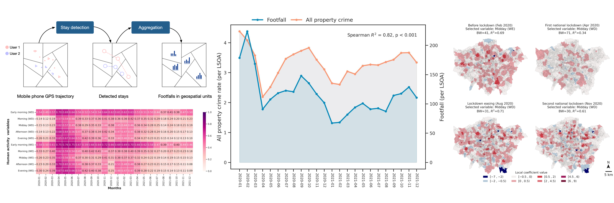
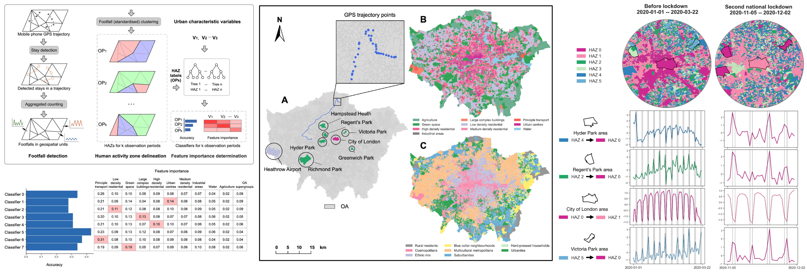
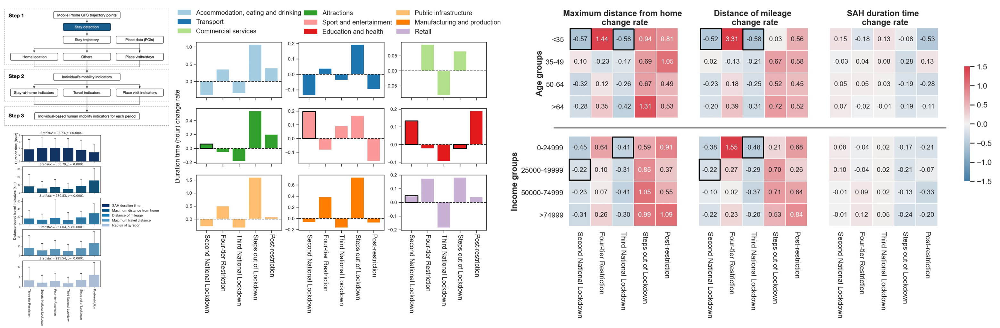
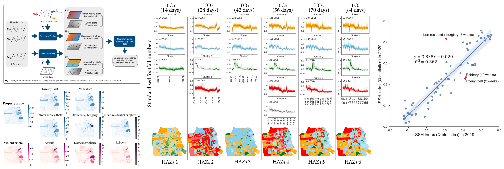
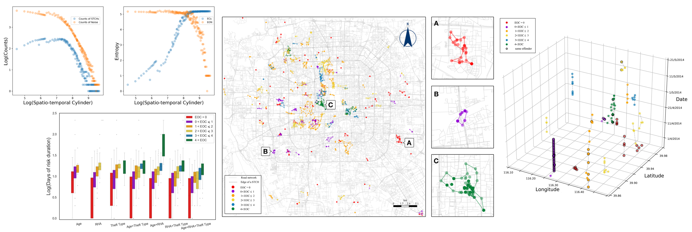

 
# Journal Articles

--------------------

Applying dynamic human activity to disentangle property crime patterns in 
London during the pandemic: An empirical analysis using geo-tagged big data

 
Abstract: This study aimed to evaluate the relationships between different groups of 
explanatory variables (i.e., dynamic human activity variables, static variables 
of social disorganisation and crime generators, and combinations of both sets of variables) 
and property crime patterns across neighbourhood areas of London during the pandemic (from 2020 to 2021). 
Using the dynamic human activity variables sensed from mobile phone GPS big data sets, 
three types of ‘Least Absolute Shrinkage and Selection Operator’ (LASSO) regression 
models (i.e., static, dynamic, and static and dynamic) differentiated into explanatory 
variable groups were developed for seven types of property crime. Then, the geographically 
weighted regression (GWR) model was used to reveal the spatial associations between distinct explanatory 
variables and the specific type of crime. The findings demonstrated that human activity dynamics impose 
a substantially stronger influence on specific types of property crimes than other static variables. 
In terms of crime type, theft obtained particularly high relationships with dynamic human activity 
compared to other property crimes. Further analysis revealed important nuances in the spatial associations 
between property crimes and human activity across different contexts during the pandemic. 
The result provides support for crime risk prediction that considers the impact of dynamic human activity 
variables and their varying influences in distinct situations. 

Citation: Chen, Tongxin*, Kate Bowers, and Tao Cheng. 2023.
"Applying Dynamic Human Activity to Disentangle Property Crime Patterns in London during the Pandemic:
An Empirical Analysis Using Geo-Tagged Big Data" ISPRS International Journal of Geo-Information 12, no.12: 488. 
https://doi.org/10.3390/ijgi12120488

--------------------

Sensing dynamic human activity zones using geo-tagged big data in Greater London, UK 
during the COVID-19 pandemic

 
Abstract: Exploration of dynamic human activity gives significant insights into understanding the urban environment and
can help to reinforce scientific urban management strategies. 
Lots of studies are arising regarding the significant human activity changes in global metropolises 
and regions affected by COVID-19 containment policies. However, the variations of human activity 
dynamics amid different phases divided by the non-pharmaceutical intervention policies
(e.g., stay-at-home, lockdown) have not been investigated across urban areas in space and time and discussed
with the urban characteristic determinants. In this study, we aim to explore the influence of 
different restriction phases on dynamic human activity through sensing human activity zones (HAZs) 
and their dominated urban characteristics. Herein, we proposed an explainable analysis framework to 
explore the HAZ variations consisting of three parts, i.e., footfall detection, HAZs delineation and 
the identification of relationships between urban characteristics and HAZs. In our study area of Greater 
London, United Kingdom, we first utilised the footfall detection method to extract human activity metrics 
(footfalls) counted by visits/stays at space and time from the anonymous mobile phone GPS trajectories. 
Then, we characterised HAZs based on the homogeneity of daily human footfalls at census output areas (OAs) 
during the predefined restriction phases in the UK. Lastly, we examined the feature importance of 
explanatory variables as the metric of the relationship between human activity and urban characteristics 
using machine learning classifiers. The results show that dynamic human activity exhibits statistically 
significant differences in terms of the HAZ distributions across restriction phases and is strongly 
associated with urban characteristics (e.g., specific land use types) during the COVID-19 pandemic. 
These findings can improve the understanding of the variation of human activity patterns during the 
pandemic and offer insights into city management resource allocation in urban areas concerning dynamic 
human activity.

Citation: Chen, Tongxin*, Di Zhu, Tao Cheng*, Xiaowei Gao, and Huanfa Chen. 
"Sensing dynamic human activity zones using geo-tagged big data in Greater London, UK 
during the COVID-19 pandemic." Plos one 18, no. 1 (2023): e0277913.

--------------------

Human mobility variations in response to restriction policies during the COVID-19 pandemic: 
An analysis from the Virus Watch community cohort in England, UK

 
Abstract:
Objective: Since the outbreak of COVID-19, public health and social measures to contain its transmission 
(e.g., social distancing and lockdowns) have dramatically changed people's lives in rural and urban areas 
globally. To facilitate future management of the pandemic, it is important to understand how different 
demographic groups adhere to such demands. This study aims to evaluate the influences of restriction policies 
on human mobility variations associated with socio-demographic groups in England, UK.

Methods: Using mobile phone global positioning system (GPS) trajectory data, we measured variations 
in human mobility across socio-demographic groups during different restriction periods from Oct 14, 2020 
to Sep 15, 2021. The six restriction periods which varied in degree of mobility restriction policies, 
denoted as “Three-tier Restriction,” “Second National Lockdown,” “Four-tier Restriction,” 
“Third National Lockdown,” “Steps out of Lockdown,” and “Post-restriction,” respectively. 
Individual human mobility was measured with respect to the time period people stayed at home, 
visited places outside the home, and traveled long distances. 
We compared these indicators across the six restriction periods and across socio-demographic groups.

Results: All human mobility indicators significantly differed across the six restriction periods, 
and the influences of restriction policies on individual mobility behaviors are correlated with 
socio-demographic groups. In particular, influences relating to mobility behaviors are stronger 
in younger and low-income groups in the second and third national lockdowns.

Conclusions: This study enhances our understanding of the influences of COVID-19 pandemic restriction 
policies on human mobility behaviors within different social groups in England. 
The findings can be usefully extended to support policy-making by investigating human mobility and 
differences in policy effects across not only age and income groups, but also across geographical regions.

Ciatation: Cheng, Tao*, Tongxin Chen*, Yunzhe Liu, Robert W. Aldridge, 
Vincent Nguyen, Andrew C. Hayward, and Susan Michie. 
"Human mobility variations in response to restriction policies during the COVID-19 pandemic: 
An analysis from the Virus Watch community cohort in England, UK." 
Frontiers in public health 10 (2022): 999521.

--------------------

Spatio-temporal stratified associations between urban human activities and crime patterns: 
a case study in San Francisco around the COVID-19 stay-at-home mandate

 
Abstract: Crime changes have been reported as a result of human routine activity shifting due to containment policies, 
such as stay-at-home (SAH) mandates during the COVID-19 pandemic. However, the way in which the manifestation 
of crime in both space and time is affected by dynamic human activities has not been explored in depth in 
empirical studies. Here, we aim to quantitatively measure the spatio-temporal stratified associations 
between crime patterns and human activities in the context of an unstable period of the ever-changing 
socio-demographic backcloth. We propose an analytical framework to detect the stratified associations 
between dynamic human activities and crimes in urban areas. In a case study of San Francisco, United States, 
we first identify human activity zones (HAZs) based on the similarity of daily footfall signatures on 
census block groups (CBGs). Then, we examine the spatial associations between crime spatial distributions 
at the CBG-level and the HAZs using spatial stratified heterogeneity statistical measurements. 
Thirdly, we use different temporal observation scales around the effective date of the SAH mandate during 
the COVID-19 pandemic to investigate the dynamic nature of the associations. The results reveal that 
the spatial patterns of most crime types are statistically significantly associated with that of human 
activities zones. Property crime exhibits a higher stratified association than violent crime across all 
temporal scales. Further, the strongest association is obtained with the eight-week time span centred 
around the SAH order. These findings not only enhance our understanding of the relationships between urban 
crime and human activities, but also offer insights into that tailored crime intervention strategies need 
to consider human activity variables.

Citation: Chen, Tongxin, Kate Bowers, Di Zhu*, Xiaowei Gao, and Tao Cheng. 
"Spatio-temporal stratified associations between urban human activities and crime patterns: 
a case study in San Francisco around the COVID-19 stay-at-home mandate." 
Computational urban science 2, no. 1 (2022): 13.Chen, Tongxin, Kate Bowers, Di Zhu, Xiaowei Gao, 
and Tao Cheng. "Spatio-temporal stratified associations between urban human activities 
and crime patterns: a case study in San Francisco around the COVID-19 stay-at-home mandate." 
Computational urban science 2, no. 1 (2022): 13.

--------------------

Exploring the homogeneity of theft offenders in spatio-temporal crime hotspots

 
Abstract: Offender homogeneity occurs when the same criminal group is composed of offenders with similar 
attributes (e.g., socio-economic-demographics). Exploring the homogeneity of offenders within spatio-temporal 
crime hotspots (STCHs) is useful for understanding not only the generational mechanisms of crime hotspots, 
but also has crime prevention implications. However, the homogeneity of offenders within STCHs has not 
been explored in criminological studies hitherto. Indeed, current techniques of STCH detection are limited 
to using statistical clustering methods in existing studies that lack the ability to identify the shape of 
STCHs or the distribution and variety of offences/offender activity with them. In this study, we utilise a 
spatio-temporal clustering algorithm called ST-DBSCAN to determine STCHs. We then propose novel 
entropy-based indices that measure the similarity of offenders (and offences) within STCHs. 
The method is demonstrated using theft crime records in the central area of Beijing, China. 
The results show that theft in the city is concentrated in a narrow space and time span (STCHs) and that 
within these associated offenders with similar social demographics, referred to as homogeneous offender 
groups are detectable.

Citation: Chen, Tongxin, Kate Bowers, Tao Cheng*, Yang Zhang, and Peng Chen. 
"Exploring the homogeneity of theft offenders in spatio-temporal crime hotspots." 
Crime Science 9, no. 1 (2020): 1-13.

--------------------

# Conference Papers
 
--------------------

<strong>Chen, Tongxin*</strong>, Xiaowei Gao and Tao Cheng (2023). 
<strong>Revealing the relationship between human mobility and urban deprivation 
using geo-big data: a case study from London in the post-pandemic era</strong> 
In: Geographical Information Science Research UK (GISRUK) 2023 Proceedings. 
GISRUK: Glasgow, UK, April 2021.

<strong>Chen, Tongxin*</strong>, Tao Cheng and Di Zhu (2021). 
<strong>The exploration of human activity zones using geo-tagged big data 
during the COVID-19 first lockdown in London, UK.</strong> 
In: Geographical Information Science Research UK (GISRUK) 2021 Proceedings. 
GISRUK: Cardiff, UK, April 2021.

<strong>Chen, Tongxin*</strong> and Tao Cheng (2020). 
<strong>Identifying Optimal Scales for Spatio-temporal Crime Clusters.</strong> 
In: Geographical Information Science Research UK (GISRUK) 2020 Proceedings. 
GISRUK: London, UK, April 2020.

<strong>Chen, Tongxin</strong> , Tao Cheng*, and Yang Zhang (2019). 
<strong>Exploring the Homogeneity of Offenders in Crime Hotspots.</strong> 
In: Geographical Information Science Research UK (GISRUK) 2019 Proceedings. 
GISRUK: Newcastle, UK, April 2019.

# Book Chapters
--------------------
 

 